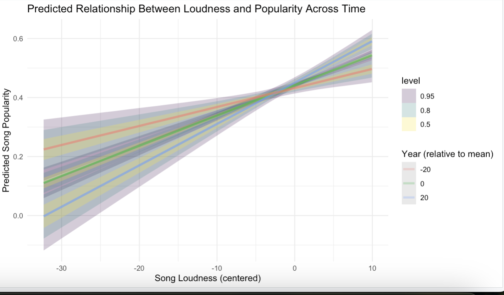

# 1. Introduction

This project analyzes factors influencing song popularity using Bayesian modeling.

# 2. Research Questions

This analysis explores three research questions:

1.  What song features most strongly predict song popularity?
2.  Has the relationship between song loudness and popularity changed over time?
3.  How much of song popularity comes from artist effects?

# 3. Data Preparation

```{r echo=TRUE, results='hide',message=FALSE, warning=FALSE}
# load libraries
library(bayesrules)
library(kableExtra)
library(rstanarm)
library(bayesplot)
library(tidyverse)
library(broom.mixed)
library(tidybayes)

# load dataset
music <- read_csv("../data/music_clean.csv")

## filter 0 song.hottnesss scores
music <- music %>% filter(song.hotttnesss > 0)
dim(music)
```
Song popularity contains a large number of exact zeros, likely reflecting missing data rather than true popularity scores. These observations were excluded prior to analysis.

The processed dataset contains 4214 rows and 31 features.


# 4. Analysis
# Question 1: What song features most strongly predict song popularity?

## Question Introduction

To investigate which song characteristics predict popularity, we fit a Bayesian multiple linear regression model. Song popularity (song.hottness) which ranges from 0 to 1, and a higher value indicates more popular songs. The predictors considered are: 

- song tempo (in beats per minute) 
- song duration (seconds) 
- song loudness (general loudness )

We use Bayesian linear regression to estimate how these features are associated with popularity.


## Exploratory Data Analysis

Before fitting the model, we examined the relationships between the predictors and popularity.

:::: {.columns}

::: {.column width="50%"}
```{r tempo}
ggplot(music, aes(song.tempo, song.hotttnesss)) +
  geom_point(alpha = 0.3) +
  geom_smooth(method = "loess") +
  labs(title = "Popularity vs Tempo",
       x = "Tempo (BPM)",
       y = "Song Popularity")
```
:::

::: {.column width="50%"}
```{r duration}
ggplot(music, aes(song.duration, song.hotttnesss)) +
  geom_point(alpha = 0.3) +
  geom_smooth(method = "loess") +
  coord_cartesian(xlim = c(0, 600)) +
  labs(title = "Popularity vs Duration",
       x = "Duration (seconds)",
       y = "Song Popularity")
```
:::

::::

:::: {.columns}

::: {.column width="25%"}
:::

::: {.column width="50%"}
```{r loudness}
ggplot(music, aes(song.loudness, song.hotttnesss)) +
  geom_point(alpha = 0.3) +
  geom_smooth(method = "loess") +
  labs(title = "Popularity vs Loudness",
       x = "Loudness (dB)",
       y = "Song Popularity")
```
:::

::: {.column width="25%"}
:::

::::

## Bayesian Regression Model

$$
\begin{gather}
Y_i \sim N(\mu_i, \sigma) \\ 
\mu_i = \beta_0 + \beta_1 \text{tempo}_i + \beta_2 \text{duration}_i + \beta_3 \text{loudness}_i
\end{gather}
$$

| Parameter | Description |
|-----------|-------------|
| $\beta_0$ | Intercept |
| $\beta_1, \beta_2, \beta_3$ | Effects of song features |
| $\sigma$ | Residual variation in popularity |

::: {.notes}
Walk through the model structure — Y is song popularity, each beta captures the effect of one audio feature.
:::

## Prior Distributions

Weakly informative priors allow moderate relationships while preventing unrealistic estimates.

| Parameter | Prior |
|-----------|-------|
| $\beta_0$ | $Normal(0, 1)$ |
| $\beta_1, \beta_2, \beta_3$ | $Normal(0, 2.5)$ |
| $\sigma$ | $Exponential(1)$ |

::: {.notes}
Priors are weakly informative, they keep estimates at reasonable values but let the data take lead. Normal(0, 2.5) means we don't expect huge effects.
:::

## Fit the Model

This model estimates the posterior distribution of each coefficient using MCMC.
```{r}
#| echo: true
song_model1 <- stan_glm(
  song.hotttnesss ~ song.tempo + song.duration + song.loudness,
  data = music,
  family = gaussian,
  prior_intercept = normal(0, 1),
  prior = normal(0, 2.5, autoscale = TRUE),
  prior_aux = exponential(1, autoscale = TRUE),
  chains = 4,
  iter = 4000,
  seed = 123
)
```

::: {.notes}
4 chains, 4000 iterations each. autoscale = TRUE lets rstanarm rescale priors to match the data scale automatically.
:::

## Prior Specification

The priors used in the model are weakly informative, letting the data drive estimates.
```{r}
prior_summary(song_model1)
```

::: {.notes}
Priors are centered at zero, reflecting no strong prior expectation of large effects. The intercept prior allows the baseline popularity to vary moderately. Coefficients can be positive or negative, and autoscale adjusts the scale based on each predictor's SD.
:::

## MCMC Diagnostics: Trace Plots

Chains should look like "fuzzy caterpillars" meaning they are well-mixed with no trends.
```{r}
#| fig-height: 4
mcmc_trace(song_model1, size = 0.2)
```

::: {.notes}
The four chains mix well and fluctuate around stable values with no noticeable trends which indicates the chains have explored the posterior distribution effectively and converged successfully.
:::

## MCMC Diagnostics: Density Overlay

Posterior distributions for each parameter across all 4 chains.
```{r}
#| fig-height: 4
mcmc_dens_overlay(song_model1)
```

::: {.notes}
Strong overlap between all four chain densities — this confirms that all chains converged to the same posterior distribution.
:::

## MCMC Diagnostics: Autocorrelation

Low autocorrelation means the chains are exploring the posterior efficiently.
```{r}
#| fig-height: 4
mcmc_acf(song_model1)
```

::: {.notes}
Autocorrelation between successive draws decreases as lag increases which is expected behavior for well-behaved MCMC sampling and indicates efficient exploration of the posterior.
:::

## MCMC Diagnostics: Rhat & N-eff
```{r}
#| echo: true
rhat(song_model1)
neff_ratio(song_model1)
```

- Rhat close to 1 (< 1.01) which indicates convergence
- N-eff ratio  > 0.1 which indicates efficient sampling

::: {.notes}
Effective sample size ratios are reasonably large, indicating efficient posterior sampling. R-hat values are all very close to 1, providing further evidence that the chains converged. Overall, the diagnostics confirm the posterior samples are reliable for inference.
:::

## Posterior Summary
```{r}
tidy(song_model1, conf.int = TRUE) %>%
  mutate(across(where(is.numeric), round, 3)) %>%
  knitr::kable() %>%
  kable_styling(font_size = 18)
```

- Intercept (0.503): Baseline popularity when predictors are zero.
- Tempo & Duration: Effects ~0; no meaningful impact on popularity.
- Loudness: Small positive effect, credible interval excludes zero → slight influence.

::: {.notes}
The intercept (0.503) represents the expected popularity of a song when all predictors are at zero. While zero tempo or duration is not meaningful in practice, this provides a baseline for the model.

Tempo and duration have posterior estimates essentially equal to zero, with credible intervals also at zero. This indicates no detectable effect of tempo or duration on song popularity in this dataset. Changes in tempo or duration do not appear to influence popularity.

Loudness has a small positive effect: for every one-unit increase in loudness, the expected popularity increases by about 0.007. The 95% credible interval (0.006 – 0.008) does not include zero, indicating this effect is statistically meaningful in the Bayesian sense. However, the effect size is very small, so loudness explains only a minor portion of the variation in song popularity.
:::

## Posterior Predictive Check

Most simulated distributions follow the observed data. There's a slight difference at lower popularity values (0.1-0.2). Model fits reasonably well overall, but may not fully capture the extremes of very low popularity. 
```{r}
pp_check(song_model1)
```

::: {.notes}
The comparison of the observed and posterior simulated music data indicates that the features have some useful information about song popularity, but they aren't driving predictors. 
:::

## Interpretation

> Tempo, duration, and loudness have **limited predictive power** for song popularity on their own.

- Credible intervals for all three predictors overlap zero
- Large residual variance $\sigma$ suggests other factors dominate
- Likely missing variables: artist popularity, familiarity, location

**Future work:** incorporate artist-level features to better explain popularity


# Question 2: Has the relationship between song loudness and popularity changed over time?

<<<<<<< HEAD
=======
## Model

$$
Y_i = \beta_0 + \beta_1 \text{loudness}_i + \beta_2 \text{year}_i + \beta_3 (\text{loudness}_i \times \text{year}_i)
$$

- $\beta_3$ = change in loudness effect over time

---

## Fit the Model

```{r echo=FALSE, message=FALSE, warning=FALSE}
music_q2 <- music %>%
  filter(song.year > 0, song.hotttnesss > 0) %>%
  mutate(
    year_centered = song.year - mean(song.year),
    loudness_centered = song.loudness - mean(song.loudness)
  )

model_loudness_year <- stan_glm(
  song.hotttnesss ~ loudness_centered * year_centered,
  data = music_q2,
  family = gaussian,
  prior_intercept = normal(0, 1),
  prior = normal(0, 2.5, autoscale = TRUE),
  prior_aux = exponential(1, autoscale = TRUE),
  chains = 4,
  iter = 4000,
  seed = 123
)
```

## Results
```{r 0}
mcmc_intervals(
  as.matrix(model_loudness_year),
  pars = c(
    "loudness_centered",
    "year_centered",
    "loudness_centered:year_centered"
  )
)
```

---

## Posterior Prediction Visualization

{width=65%}

::: {.notes}
This posterior prediction plot shows the relationship between loudness and predicted popularity at earlier, average, and later years. The lines are nearly parallel, which supports the conclusion that the effect of loudness on popularity has remained relatively stable over time.
:::


>>>>>>> 5efde14 (added question 2 analysis + graphs)
# Question 3: How much of song popularity comes from artist effects?

## Question Introduction

To investigate how much of song popularity is driven by artist identity rather than song features, we fit a Bayesian hierarchical model. Song popularity (`song.hotttnesss`) ranges from 0 to 1. We group songs by artist and estimate how much variance is explained at the artist level using a random intercepts model.

-   **Within-artist variation**: differences between songs by the same artist
-   **Between-artist variation**: differences in average popularity across artists

## Exploratory Data Analysis

Before fitting the model, we identified artists with highly similar sound profiles to isolate artist identity as the key variable.

```{r}
#| echo: false
#| message: false
#| warning: false

# --- Setup: build chosen_artists ---
artist_stats <- music %>%
  drop_na(artist.name, song.hotttnesss, song.tempo, song.loudness, song.duration) %>%
  group_by(artist.name) %>%
  summarize(
    n_songs = n(),
    mean_pop = mean(song.hotttnesss),
    mean_tempo = mean(song.tempo),
    mean_loudness = mean(song.loudness),
    mean_duration = mean(song.duration)
  ) %>%
  filter(n_songs >= 5)

scaled_features <- artist_stats %>%
  mutate(
    z_tempo = as.numeric(scale(mean_tempo)),
    z_loudness = as.numeric(scale(mean_loudness)),
    z_duration = as.numeric(scale(mean_duration))
  )

target_artist_name <- "Thrice"

target_params <- scaled_features %>%
  filter(artist.name == target_artist_name) %>%
  select(z_tempo, z_loudness, z_duration)

chosen_artists <- scaled_features %>%
  mutate(
    distance = sqrt(
      (z_tempo - target_params$z_tempo)^2 +
        (z_loudness - target_params$z_loudness)^2 +
        (z_duration - target_params$z_duration)^2
    )
  ) %>%
  arrange(distance) %>%
  slice(1:4) %>%
  pull(artist.name)

# --- Plot ---
music %>%
  filter(artist.name %in% chosen_artists) %>%
  drop_na(song.hotttnesss) %>%
  ggplot(aes(x = reorder(artist.name, song.hotttnesss, FUN = median), y = song.hotttnesss)) +
  geom_boxplot(fill = "lightcyan", outlier.shape = NA) +
  geom_jitter(color = "darkblue", alpha = 0.5, width = 0.15, height = 0) +
  labs(
    title = "Song Popularity for Artists with Highly Similar Sound Profiles",
    subtitle = "Comparing artists matched by average tempo, loudness, and duration",
    x = "Artist",
    y = "Song Popularity (hotttnesss)"
  ) +
  theme_minimal() +
  theme(
    plot.title = element_text(face = "bold", size = 14),
    axis.text.x = element_text(size = 11)
  )
```

```{r}
#| echo: false
#| message: false
#| warning: false
music %>%
  filter(artist.name %in% chosen_artists) %>%
  drop_na(song.hotttnesss) %>%
  ggplot(aes(x = reorder(artist.name, song.hotttnesss, FUN = median), y = song.hotttnesss)) +
  geom_boxplot(fill = "lightcyan", outlier.shape = NA) +
  geom_jitter(color = "darkblue", alpha = 0.5, width = 0.15, height = 0) +
  labs(
    title = "Song Popularity for Artists with Highly Similar Sound Profiles",
    subtitle = "Comparing artists matched by average tempo, loudness, and duration",
    x = "Artist",
    y = "Song Popularity (hotttnesss)"
  ) +
  theme_minimal() +
  theme(
    plot.title = element_text(face = "bold", size = 14),
    axis.text.x = element_text(size = 11)
  )
```

::: notes
These four artists have nearly identical tempo, loudness, and duration profiles — yet their popularity distributions are very different. This motivates the question: is artist identity itself driving popularity?
:::

## Bayesian Hierarchical Model

$$
\begin{gather}
Y_{ij} \sim N(\mu_{ij}, \sigma) \\
\mu_{ij} = \beta_0 + b_j \\
b_j \sim N(0, \sigma_{\text{artist}})
\end{gather}
$$

| Parameter                | Description                          |
|--------------------------|--------------------------------------|
| $\beta_0$                | Global mean popularity               |
| $b_j$                    | Artist-specific random intercept     |
| $\sigma$                 | Within-artist (song-level) variation |
| $\sigma_{\text{artist}}$ | Between-artist variation             |

::: notes
Each artist gets their own intercept b_j, which shifts their expected popularity up or down from the global mean. The ICC tells us what fraction of total variance comes from these artist-level shifts.
:::

## Prior Distributions

Weakly informative priors allow moderate artist effects while preventing unrealistic estimates.

| Parameter                | Prior            |
|--------------------------|------------------|
| $\beta_0$                | $Normal(0.5, 1)$ |
| $\sigma_{\text{artist}}$ | $Exponential(1)$ |
| $\sigma$                 | $Exponential(1)$ |

::: notes
We center the intercept prior at 0.5 since popularity is bounded between 0 and 1. The exponential priors on both variance components keep estimates positive and let the data determine how much variation sits at the artist vs song level.
:::

## Fit the Model

```{r}
#| echo: true
#| cache: true

# Step 1: prepare data BEFORE passing to stan_glmer
music_model <- music %>%
  drop_na(artist.name, song.hotttnesss) %>%
  group_by(artist.name) %>%
  filter(n() >= 5) %>%
  ungroup()

# Step 2: fit model using the clean dataset
model_q3 <- stan_glmer(
  song.hotttnesss ~ (1 | artist.name),
  data = music_model,
  family = gaussian,
  prior_intercept = normal(0.5, 1),
  prior_aux = exponential(1, autoscale = TRUE),
  chains = 4,
  iter = 4000,
  seed = 123
)
```

::: notes
The (1 \| artist.name) syntax fits a random intercept per artist. 4 chains, 5000 iterations. autoscale adjusts the prior scale to match the data automatically.
:::

## MCMC Diagnostics

Chains are well mixed with no trends and R hat\>1 confirms convergence.

::::: columns
::: {.column width="50%"}
```{r}
#| fig-height: 4
#| echo: false
mcmc_trace(model_q3,
           pars = c("(Intercept)",
                    "sigma",
                    "Sigma[artist.name:(Intercept),(Intercept)]",
                    "b[(Intercept) artist.name:30_Seconds_To_Mars]",
                    "b[(Intercept) artist.name:Kraftwerk]",
                    "b[(Intercept) artist.name:Thrice]",
                    "b[(Intercept) artist.name:Muse]",
                    "b[(Intercept) artist.name:Jacques_Dutronc]",
                    "b[(Intercept) artist.name:Coldplay]",
                    "b[(Intercept) artist.name:Los_Fabulosos_Cadillacs]",
                    "b[(Intercept) artist.name:David_Arkenstone]"),
           size = 0.2)
```
:::

::: {.column width="50%"}
```{r}
#| echo: false
#| fig-height: 4

mcmc_dens_overlay(model_q3,
                  pars = c("(Intercept)",
                           "sigma",
                           "Sigma[artist.name:(Intercept),(Intercept)]",
                           "b[(Intercept) artist.name:30_Seconds_To_Mars]",
                           "b[(Intercept) artist.name:Kraftwerk]",
                           "b[(Intercept) artist.name:Thrice]",
                           "b[(Intercept) artist.name:Muse]",
                           "b[(Intercept) artist.name:Jacques_Dutronc]",
                           "b[(Intercept) artist.name:Coldplay]",
                           "b[(Intercept) artist.name:Los_Fabulosos_Cadillacs]",
                           "b[(Intercept) artist.name:David_Arkenstone]"))
```
:::
:::::

```{r}
#| echo: true
rhat(model_q3)
neff_ratio(model_q3)
```

::: notes
Rhat close to 1 confirms convergence. Strong density overlap across chains confirms they all explored the same posterior. N-eff ratios above 0.1 indicate efficient sampling.
:::

## Posterior Predictive Check

```{r}
pp_check(model_q3)
```

The model captures the overall shape of the popularity distribution well. Some underfitting at the extremes is expected since song-level features are not included.

::: notes
The posterior predictive check confirms the hierarchical model produces realistic popularity distributions. Deviations at the tails suggest there are additional song-level predictors worth including in future models.
:::

## Variance Components: Artist vs Song

```{r}
#| echo: false
tidy(model_q3, effects = "ran_pars") %>%
  mutate(
    Component = c("Between-Artist (Sigma)", "Within-Artist (Sigma)"),
    Estimate = round(estimate, 3),
    Interpretation = c("How much artists differ in avg popularity",
                       "How much songs vary within the same artist")
  ) %>%
  select(Component, Estimate, Interpretation) %>%
  knitr::kable() %>%
  kable_styling(font_size = 20)
```

-   **Between-artist (0.129)**: artist identity shifts expected popularity up or down from the global mean
-   **Within-artist (0.113)**: even within the same artist, individual songs vary considerably in hotttnesss
-   Artist identity accounts for **\~53%** of total variance $(0.129 / (0.129 + 0.113))$

::: notes
The two sigmas are close but between-artist edges out within-artist — meaning the biggest single predictor of a song's popularity is simply who made it, not what it sounds like.
:::

## Interpretation

> Artist identity explains a **meaningful share** of song popularity variance, independent of musical features.

-   Between-artist (0.129) exceeds within-artist (0.113) variation, **\~53% of popularity differences are driven by artist identity alone.**
-   Well-mixed trace plots and Rhat ≈ 1 confirm reliable estimates for all artist popularity shifts.
-   PPC fits well at 0.5–0.6 but misses at extremes (0.0/0.9), showing artist identity best explains mid-range popularity.
